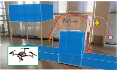

# lbac
This is the repository for the paper [Reinforcement Learning for Safe Robot Control using Control Lyapunov Barrier Functions (ICRA 2023)](https://arxiv.org/abs/2305.09793).

<!-- image -->

  

Our approach learns a **Control Lyapunov Barrier Function (CLBF)** to simultaneously ensure safety and reachability. The CLBF is learned via a SAC-based framework **without explicit knowledge** of the system dynamics. 

We demonstrate our approach on a 2D quadrotor navigation task, where the quadrotor must avoid obstacles while reaching a goal. A demo video can be found [here](https://www.youtube.com/watch?v=_8Yr_QRRYik).

Code coming soon.
